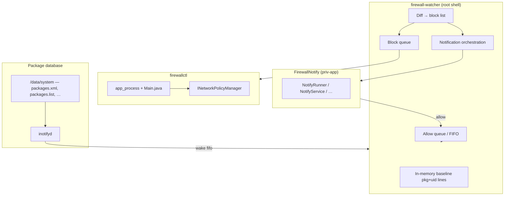

# Architecture

This document describes how **android-firewallctl** is put together. It matches
the code as of the in-memory-baseline watcher (`memdiff`); older docs that
mentioned `known.txt` on disk are obsolete.

## Goals

1. **One source of truth** — per-app network policy lives in
   `NetworkPolicyManagerService` (NPMS), same as Lineage/AOSP Settings.
2. **No parallel firewall** — no VPN capture, no extra iptables tables that
   drift from Settings.
3. **Default deny for new user apps** (Magisk module) — block quickly after
   install, with a notification to allow.

## Components

| Piece | Path | Role |
|---|---|---|
| CLI | `src/app/firewallctl/Main.java` + `scripts/firewallctl` | Reflection Binder client; `get` / `set` / `clear` / `list-*`. |
| Watcher | `magisk/system/bin/firewall-watcher` | Daemon: baseline, diff, enqueue block, notify, allow queues. |
| Allow helper | `magisk/system/bin/firewall-allow-app` | `clear` + `-REJECT_ALL` for one package (does not edit allowlist). |
| Notify APK | `src/notify/…` → `FirewallNotify.apk` | Channels, blocked notification, Allow action. |
| Boot | `magisk/service.sh` | After boot: ensure notify app, start watcher. |

## Why `firewallctl` uses reflection

The CLI is compiled **without** `android.jar`. At runtime (as root) it:

1. Relaxes hidden API access (best effort).
2. Gets `INetworkPolicyManager` from `ServiceManager` (`netpolicy`).
3. Discovers `POLICY_*` constants from `NetworkPolicyManager` via reflection.

New ROM policy flags appear in `list-policies` without rebuilding against a
specific SDK.

## Install detection (Magisk module)

### Baseline (in RAM only)

On start, the daemon loads third-party packages (`pm list packages -3 -U`)
into **`BASELINE`** — a list of lines `package.name uid`.  
**Nothing is written to disk as a package snapshot** (no `known.txt`).

The first trusted load establishes baseline **without blocking** existing apps.

### What triggers a reconcile

1. **`inotifyd`** watches **`/data/system`** (directory watch, not a single file).
2. Callbacks filter events for `packages.xml`, `packages.list`, and `.new`
   variants.
3. The callback writes to a **wake FIFO**; the long-running daemon process
   runs `handle_package_list_change` so baseline stays in one process.

**Why watch the directory?**  
`packages.xml` is often replaced via AtomicFile rename. A watch on only the
file can get `IN_IGNORED` and kill `inotifyd`; directory-level watching
survives renames.

### Diff → block

Compare new package lines to in-memory baseline:

- **New package name** → candidate block.
- **Same name, different UID** → treat as reinstall → block again (allowlist
  does not exempt reinstalls).

Safety rails:

- Ignore lists with fewer than `FIREWALL_MIN_USER_PACKAGES` (default 5) lines.
- Ignore suspicious **drops** in package count vs baseline.
- If more than `FIREWALL_MASS_BLOCK_LIMIT` (default 10) packages would block,
  update baseline only and log (no mass block).

Blocking is **async**: names go on `block_queue`; a worker runs
`firewallctl set <pkg> +REJECT_ALL` with retries until the package appears in
`packages.list`.

### Allowlist semantics

`/data/adb/firewall_default_deny/allowlist.txt` is **manual only** — for
sideloaded apps you never want auto-blocked. The watcher **never writes** this
file. Reinstall with a new UID is **not** skipped just because the name was
on the allowlist.

## Notifications

Posting is hard on modern Android (permissions, FGS rules, suspended packages).
The watcher tries several paths in order, logging `notify: path=…`:

1. `app_process` + `NotifyRunner` (preferred).
2. Broadcast `app.firewall.notify.SHOW_BLOCKED`.
3. Foreground service / activity fallbacks.
4. `cmd notification post` (shell).
5. Legacy service start.

`magisk/service.sh` also grants notification permission and initializes the
channel at boot. See [TROUBLESHOOTING.md](TROUBLESHOOTING.md).

## Allow flow

User taps **Allow** in the notification → APK queues or runs
`firewall-watcher --allow <pkg>` / `firewall-allow-app` → clears `REJECT_ALL`
for that package only (still **not** added to `allowlist.txt`).

Queues under `/data/adb/…` and `/data/local/tmp/…` let non-root UI code
request allow; the root watcher drains them.

## Artifacts & install locations

| Artifact | Typical path after install |
|---|---|
| CLI jar | `/system/bin/firewallctl.dex.jar` (module) or `/data/local/tmp/` |
| Wrapper | `/system/bin/firewallctl` |
| Watcher | `/system/bin/firewall-watcher` |
| Notify APK | `/system/priv-app/FirewallNotify/FirewallNotify.apk` (+ copy on module dir for fallback `pm install`) |

Termux `.deb` installs under `…/com.termux/files/usr/`.

## Further reading

- Inline design notes: top of `magisk/system/bin/firewall-watcher`.
- Runtime files: [STATE.md](STATE.md).
- What has been tested: [COMPATIBILITY.md](COMPATIBILITY.md).
